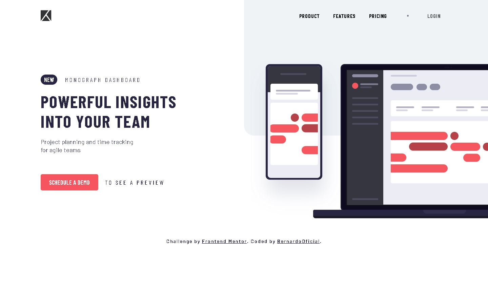
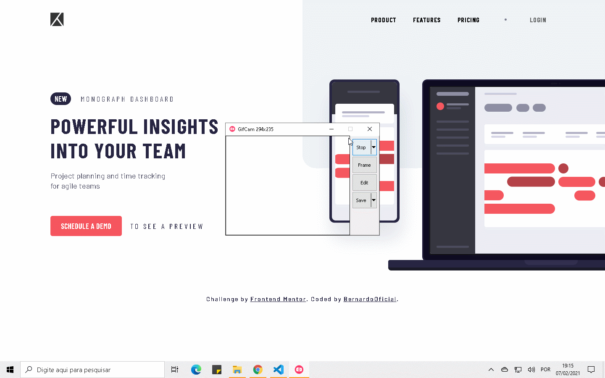

# Project Tracking Intro Component Master

Esse projeto teve como objetivo o treinamento com ReactJS em um layout, utilizando como ferramentas o styled-components, para estilizar os componentes, e o hábito de componentizar os elementos em tela.

Esse projeto também foi um desafio do site do Frontend Mentor.

## Tecnologia utilizadas

- ReactJS
- Styled-components

## Apresentação do projeto

